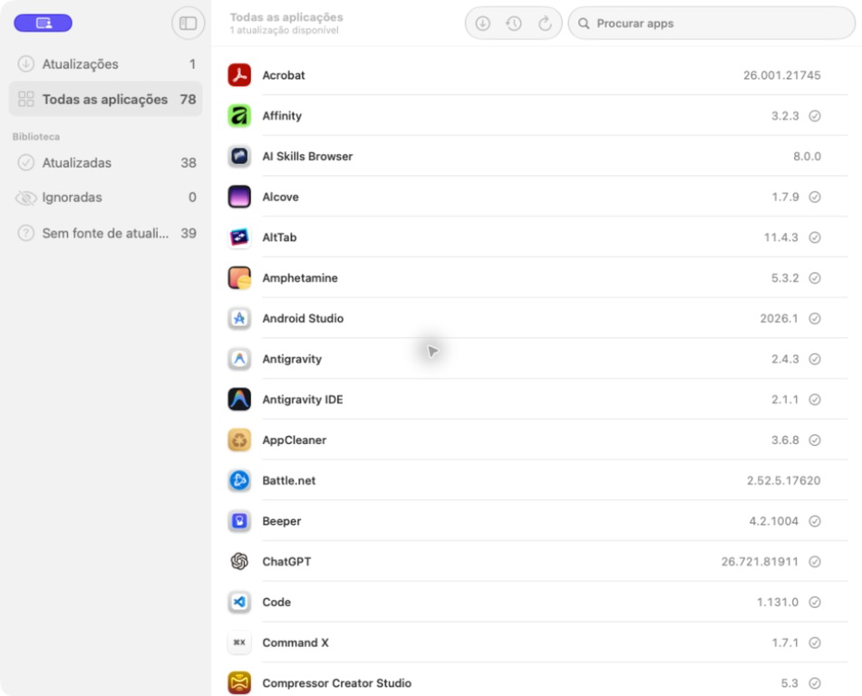

<div align="center">

# Freshly

**Keep every app on your Mac fresh — from one place, for free.**

[](https://github.com/ruimiguelcolaco/freshly/actions/workflows/ci.yml)
[](LICENSE)


Freshly finds the apps installed on your Mac, checks five update channels
for newer versions, and installs updates after verifying every byte —
from a single window, or straight from your menu bar.

[**Build Freshly with Xcode 26 →**](#build-from-source)

<br>



</div>

> **Freshly is functional and actively developed.** Detection and updates
> work across all five supported sources, with verified installs, automatic
> background checks, notifications, release notes, and local update history.
> Signed releases and a Homebrew cask are next; until then, build Freshly
> from source. See the [roadmap](ROADMAP.md).

## At a glance

| | |
|---|---|
| **Five update sources** | Sparkle, Mac App Store, Homebrew, Electron, and GitHub Releases |
| **Automatic checks** | A resilient schedule anchored to the last completed scan |
| **Verified updates** | Signatures, checksums, identity checks, Gatekeeper, and rollback |
| **Private by design** | No account, telemetry, crash reporting, or Freshly server |
| **Native and open** | SwiftUI, menu-bar access, MIT license, community definitions |

## Why

MacUpdater, the reference tool of this category, was discontinued in
January 2026 and its database dies at the end of the year. The remaining
options are paid, subscription-based, or cover only a fraction of update
channels. Freshly aims to be the tool the Mac community keeps for itself:
fast, free, private, and open.

## What makes it different

- **Fast:** local discovery completes in about a second on a typical Mac,
  while live network results stream into the interface as sources respond.
- **Quietly automatic:** checks follow a configurable schedule, recover
  after restarts and sleep, and retry when the network or installer is busy.
- **Native:** Swift 6 and SwiftUI, with a focused sidebar, dark mode, menu-bar
  access, and a badge for pending updates.
- **Open:** MIT-licensed code and reusable CC0
  [app definitions](docs/APP_DEFINITIONS.md), reviewed and validated in public.

## Update sources

| Source | Detect | Update |
|---|---|---|
| Sparkle appcasts | ✓ | ✓ verified, in place |
| Mac App Store | ✓ | redirect to App Store¹ |
| Homebrew casks | ✓ | ✓ via brew, or directly |
| Electron (electron-updater) | ✓ | ✓ verified, in place |
| GitHub Releases | ✓² | ✓ verified, in place |

¹ Since macOS Tahoe 26.1, third-party tools can no longer install Mac App
Store updates directly; Freshly hands you off to the App Store.

² For apps mapped to a repository by a community
[app definition](docs/APP_DEFINITIONS.md) — guessing repos from bundles
would produce false matches.

## Security and privacy

Everything runs locally and Freshly has no server of its own. Sources that
support it use bulk catalog downloads, limiting app-by-app disclosure.
App-specific sources receive only the request required to check that app.
Freshly has no account, telemetry, or crash reporting. When an update fails,
you can preview and edit a locally generated, automatically redacted problem
report before choosing to open a GitHub form or email draft; nothing is sent
automatically.

Before replacing an app, Freshly verifies the publisher-provided EdDSA
signature or checksum, performs deep code-signature validation, requires
bundle identity and developer-team continuity, blocks downgrades, and asks
Gatekeeper to assess the result. The previous version is retained during
installation and restored automatically if anything fails.

## Requirements

- macOS 15 or later
- Apple Silicon or Intel

## Build from source

Freshly is distributed outside the Mac App Store because an updater needs
to run un-sandboxed to modify other applications.

Signed and notarized releases, plus a Homebrew cask, will follow with the
first tagged release. For now:

```sh
git clone https://github.com/ruimiguelcolaco/freshly.git
cd freshly
open Freshly.xcodeproj   # requires Xcode 26 or later
```

Run the core library tests without Xcode:

```sh
swift test --package-path Packages/FreshlyCore
```

Run the app orchestration tests with an unsigned test host:

```sh
xcodebuild test -project Freshly.xcodeproj -scheme Freshly \
  -destination 'platform=macOS' \
  -derivedDataPath /tmp/FreshlyDerivedData \
  CODE_SIGNING_ALLOWED=NO
```

## Command line

The package also builds a read-only CLI for scripts and CI:

```sh
swift run --package-path Packages/FreshlyCore freshly check --json
```

It scans the same locations and checks the same sources as the app, then
writes one versioned JSON document to stdout. The report contains available
updates, per-app check failures, and an unsupported-app count; it never
installs anything. Set `FRESHLY_GITHUB_TOKEN` to raise GitHub's API limit.
Because app-specific sources receive a request for the app being checked,
run the command only where that network behavior is acceptable.

## Contributing

The easiest way to help — no Swift required — is teaching Freshly about
apps it cannot match on its own: a small JSON
[app definition](docs/APP_DEFINITIONS.md) reviewed like any pull request.

For code contributions, start with [CONTRIBUTING.md](CONTRIBUTING.md) and
the [architecture overview](ARCHITECTURE.md). To add a whole new update
channel, see [docs/ADDING_A_SOURCE.md](docs/ADDING_A_SOURCE.md).

Security issues: please report privately — see [SECURITY.md](SECURITY.md).

## License

[MIT](LICENSE) — app definitions are
[CC0](https://creativecommons.org/publicdomain/zero/1.0/).
